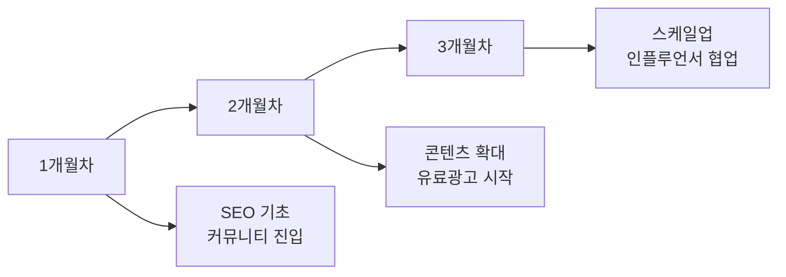

# 🚀 CoinPass 마케팅 & SEO 실전 가이드

## 📌 Quick Start - 오늘 당장 할 수 있는 것들

### 1. **구글 서치 콘솔 등록 (30분)**
1. [Google Search Console](https://search.google.com/search-console) 접속
2. 도메인 추가: `coinpass.kr`
3. 소유권 확인 (DNS 또는 HTML 파일)
4. 사이트맵 제출: `sitemap.xml`

### 2. **네이버 웹마스터도구 최적화 (30분)**
1. 이미 등록되어 있으므로 다음 설정 확인:
   - 사이트 최적화 > 검색로봇 수집
   - 사이트맵 제출
   - RSS 제출
   - 웹페이지 수집 요청

### 3. **구글 애널리틱스 설정 (1시간)**
```html
<!-- 이미 GTM이 설치되어 있으므로 GTM에서 설정 -->
1. GTM 대시보드 접속
2. 새 태그 > Google Analytics GA4
3. 측정 ID 입력
4. 트리거: All Pages
```

---

## 🎯 SEO 최적화 전략

### **1단계: 기술적 SEO (1주일)**

#### 1.1 사이트맵 생성
```xml
<!-- sitemap.xml 생성 -->
<?xml version="1.0" encoding="UTF-8"?>
<urlset xmlns="http://www.sitemaps.org/schemas/sitemap/0.9">
  <url>
    <loc>https://coinpass.kr/</loc>
    <lastmod>2024-01-01</lastmod>
    <changefreq>daily</changefreq>
    <priority>1.0</priority>
  </url>
  <url>
    <loc>https://coinpass.kr/exchange</loc>
    <changefreq>weekly</changefreq>
    <priority>0.9</priority>
  </url>
  <url>
    <loc>https://coinpass.kr/articles</loc>
    <changefreq>daily</changefreq>
    <priority>0.8</priority>
  </url>
</urlset>
```

#### 1.2 robots.txt 생성
```txt
User-agent: *
Allow: /
Disallow: /admin
Disallow: /api/

Sitemap: https://coinpass.kr/sitemap.xml
```

#### 1.3 구조화된 데이터 (Schema.org)
```html
<script type="application/ld+json">
{
  "@context": "https://schema.org",
  "@type": "FinancialService",
  "name": "코인패스",
  "url": "https://coinpass.kr",
  "description": "암호화폐 거래소 수수료 할인 서비스",
  "aggregateRating": {
    "@type": "AggregateRating",
    "ratingValue": "4.8",
    "reviewCount": "324"
  }
}
</script>
```

#### 1.4 페이지 속도 최적화
- 이미지 최적화 (WebP 변환)
- CSS/JS 압축
- 캐싱 헤더 설정
- CDN 활용

---

### **2단계: 콘텐츠 SEO (2-4주)**

#### 2.1 키워드 리서치
**주요 타겟 키워드:**
| 키워드 | 월 검색량 | 경쟁도 | 우선순위 |
|-------|---------|--------|---------|
| 바이낸스 수수료 할인 | 1,900 | 낮음 | ⭐⭐⭐⭐⭐ |
| 바이낸스 레퍼럴 | 880 | 중간 | ⭐⭐⭐⭐ |
| 바이비트 수수료 | 720 | 낮음 | ⭐⭐⭐⭐ |
| OKX 할인 코드 | 590 | 낮음 | ⭐⭐⭐⭐ |
| 거래소 수수료 비교 | 1,600 | 높음 | ⭐⭐⭐ |

#### 2.2 콘텐츠 전략
```markdown
## 필수 작성 콘텐츠 (SEO용)

1. **거래소별 가이드** (각 2000자 이상)
   - /guide/binance-fee-discount
   - /guide/bybit-referral-guide
   - /guide/okx-signup-benefits

2. **비교 콘텐츠**
   - 거래소 수수료 완벽 비교 2024
   - 초보자를 위한 거래소 선택 가이드

3. **FAQ 페이지**
   - 자주 묻는 질문 30개 이상
   - 각 답변 200자 이상
```

#### 2.3 내부 링크 구조
```
홈페이지
├── 거래소 목록 (/exchange)
│   ├── 바이낸스 상세
│   ├── 바이비트 상세
│   └── OKX 상세
├── 가이드 (/guides)
│   ├── 초보 가이드
│   └── 수수료 절약 팁
└── 블로그 (/articles)
    └── 시장 분석
```

---

## 📱 마케팅 채널별 전략

### **1. 무료 마케팅 (즉시 시작 가능)**

#### 1.1 네이버 카페/블로그
**타겟 커뮤니티:**
- 비트맨 (200만 회원)
- 땡글 (150만 회원)
- 코박 (80만 회원)

**활동 전략:**
```
1주차: 커뮤니티 규칙 파악, 유용한 정보 공유
2주차: 신뢰 구축, 댓글 활동
3주차: 자연스럽게 수수료 할인 정보 공유
4주차: 상세 가이드 작성
```

#### 1.2 유튜브 SEO
**콘텐츠 아이디어:**
- "바이낸스 수수료 90% 절약하는 방법"
- "거래소별 숨겨진 할인 혜택 총정리"
- "월 100만원 수수료 절약 실전 가이드"

#### 1.3 텔레그램/카카오톡 오픈채팅
- 암호화폐 관련 방 참여
- 유용한 정보 제공자로 포지셔닝
- DM 금지, 자연스러운 정보 공유

### **2. 유료 마케팅 (예산별)**

#### 2.1 최소 예산 (월 50-100만원)
**네이버 파워링크**
- 타겟 키워드: "바이낸스 수수료"
- CPC: 약 200-500원
- 일 예산: 2만원

**구글 애즈**
- 검색 광고만 운영
- 정확한 키워드 타겟팅
- 일 예산: 1만원

#### 2.2 중간 예산 (월 200-500만원)
**네이버 브랜드검색**
- "코인패스" 브랜드 등록
- 경쟁사 키워드 공략

**페이스북/인스타그램 광고**
- 관심사 타겟팅: 암호화폐, 투자
- 리타겟팅 캠페인
- 일 예산: 5만원

#### 2.3 고예산 (월 1000만원 이상)
**인플루언서 마케팅**
- 중소형 크립토 유튜버 (구독자 1-10만)
- 협찬비: 건당 100-500만원
- ROI 추적 필수

---

## 📊 성과 측정 및 KPI

### **주요 지표 (매주 체크)**

#### 1. 트래픽 지표
```javascript
// Google Analytics에서 확인
- 일일 방문자 수 (DAU)
- 신규 vs 재방문
- 평균 체류 시간
- 이탈률
```

#### 2. 전환 지표
```javascript
// 추적 코드 설정
dataLayer.push({
  'event': 'signup_click',
  'exchange': 'binance',
  'discount_rate': '20%'
});
```

#### 3. SEO 지표
- 키워드 순위 변화
- 백링크 증가
- 도메인 권위도 (DA)
- 페이지 로딩 속도

### **목표 설정 (3개월)**
| 지표 | 현재 | 1개월 | 2개월 | 3개월 |
|-----|------|-------|-------|-------|
| 일 방문자 | 100 | 500 | 1,500 | 3,000 |
| 가입 전환율 | 2% | 3% | 4% | 5% |
| 키워드 10위 내 | 0개 | 5개 | 15개 | 30개 |

---

## 🎯 실행 우선순위 (Action Items)

### **이번 주 필수 과제**
1. ✅ Google Search Console 등록
2. ✅ 사이트맵 생성 및 제출
3. ✅ robots.txt 생성
4. ✅ 구조화된 데이터 추가
5. ✅ 첫 블로그 포스트 작성

### **이번 달 목표**
1. ✅ 키워드별 랜딩 페이지 5개 생성
2. ✅ 네이버 카페 3곳 활동 시작
3. ✅ 유튜브 채널 개설
4. ✅ 구글 애즈 캠페인 시작
5. ✅ 이메일 수집 팝업 구현

### **3개월 로드맵**


---

## 💡 꿀팁 & 주의사항

### **Do's ✅**
1. **가치 먼저 제공**: 할인 정보 전에 유용한 정보 먼저
2. **투명성**: 레퍼럴 관계 명확히 공개
3. **신뢰 구축**: 실제 사용 후기, 증거 자료
4. **지속성**: 매일 조금씩, 꾸준히
5. **데이터 기반**: 모든 활동 측정 및 개선

### **Don'ts ❌**
1. **스팸 금지**: 무작정 링크 뿌리기
2. **과장 광고**: "100% 수익 보장" 같은 표현
3. **블랙햇 SEO**: 키워드 도배, 링크 구매
4. **저작권 침해**: 타사 로고/콘텐츠 무단 사용
5. **급한 마음**: 단기 성과에 집착

---

## 📚 추천 학습 자료

### **SEO 기초**
- [구글 SEO 가이드](https://developers.google.com/search/docs)
- [네이버 웹마스터 가이드](https://searchadvisor.naver.com)
- 유튜브: "SEO 기초" 검색

### **마케팅 툴**
- **무료**: Google Analytics, Search Console
- **유료**: Ahrefs, SEMrush (월 $99부터)
- **국내**: 블랙키위, 리스닝마인드

### **커뮤니티**
- 그로스해킹 코리아 (페이스북)
- 마케팅 커뮤니티 (디스코드)
- SEO 전문가 그룹 (링크드인)

---

## 🚀 당장 시작하기

### **오늘 할 일 (2시간)**
1. Google Search Console 등록 (30분)
2. 사이트맵 생성 (30분)
3. 첫 블로그 글 작성 (1시간)
   - 제목: "2024년 암호화폐 거래소 수수료 완벽 정리"

### **이번 주 할 일**
1. 네이버 카페 3곳 가입
2. 키워드 리서치 완료
3. 경쟁사 분석 (어떤 마케팅 하는지)
4. 콘텐츠 캘린더 작성

### **측정 방법**
```javascript
// GTM에 추가할 이벤트 추적
// 1. 거래소 클릭 추적
// 2. 스크롤 깊이 추적
// 3. 체류 시간 추적
// 4. 전환 추적 (가입 클릭)
```

---

**Remember**: 마케팅은 마라톤입니다. 🏃‍♂️
- 첫 달: 기초 다지기
- 둘째 달: 성과 나타나기 시작
- 셋째 달: 본격 성장

꾸준함이 답입니다! 화이팅! 💪